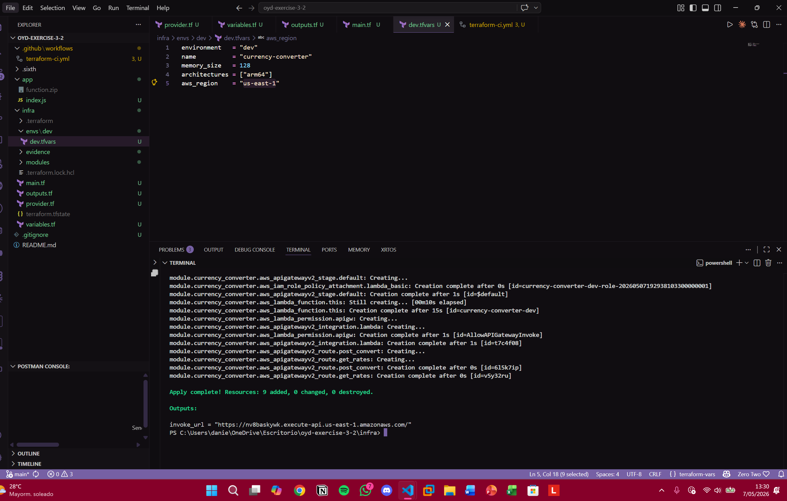
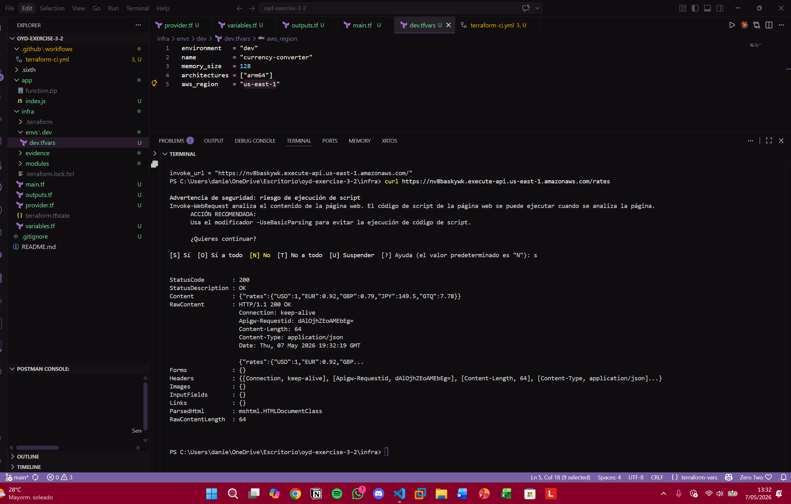
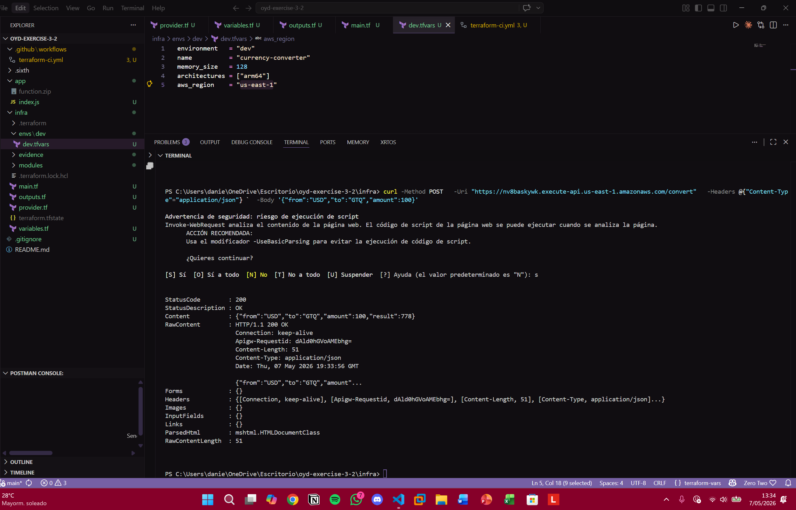
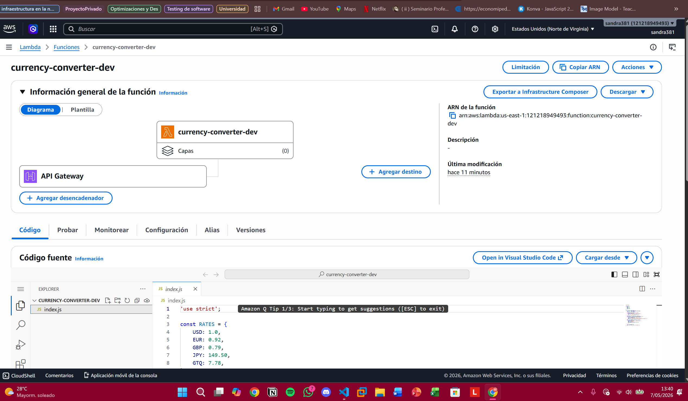
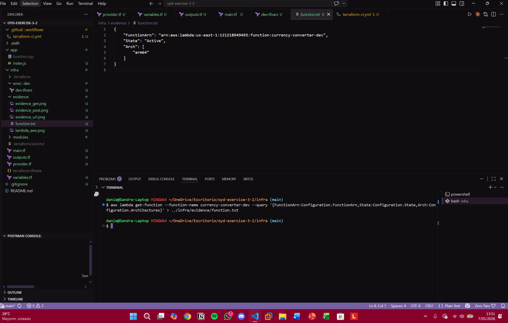

# Ejercicio 3.2 — Lambda Currency Converter

**Curso:** Optimizaciones y Desempeño — Cloud Deployment Automation  
**Estudiantes:** Gabriela Navarro y Sandra Soria

---

## Descripción

Módulo reutilizable de Terraform que provisiona una función AWS Lambda (Node.js 22.x) expuesta a través de una API Gateway HTTP API. La función implementa un convertidor de divisas mínimo con dos endpoints:

| Método | Ruta | Descripción |
|--------|------|-------------|
| GET | `/rates` | Retorna las tasas de cambio |
| POST | `/convert` | Convierte un monto entre dos divisas |

---

## Estructura del repositorio

```
oyd-exercise-3-2/
├── app/
│   └── index.js
├── infra/
│   ├── provider.tf
│   ├── variables.tf
│   ├── outputs.tf
│   ├── main.tf
│   ├── envs/
│   │   └── dev/
│   │       └── dev.tfvars
│   ├── evidence/
│   │   └── function.txt
│   └── modules/
│       └── compute_lambda/
│           ├── main.tf
│           ├── variables.tf
│           └── outputs.tf
├── .github/
│   └── workflows/
│       └── terraform-ci.yml
├── .gitignore
└── README.md
```

---

## Arquitectura

```
Internet
   │
   ▼
API Gateway (HTTP API)
   ├── GET  /rates
   └── POST /convert
         │
         ▼
   Lambda Function
   (nodejs22.x / arm64)
         │
         ▼
   CloudWatch Logs
   (IAM Role)
```

---

## Prerrequisitos

- AWS CLI configurado (`aws sts get-caller-identity` debe responder correctamente)
- Terraform CLI >= 1.8
- Node.js instalado localmente

---

## Despliegue

**1. Construir el zip de la función:**
```bash
cd app/
zip function.zip index.js
cd ..
```

**2. Inicializar y aplicar Terraform:**
```bash
cd infra/
terraform init
terraform apply -var-file=envs/dev/dev.tfvars
```

---

## Pruebas de los endpoints

**GET /rates**
```bash
curl https://nv8baskywk.execute-api.us-east-1.amazonaws.com/rates
```

Respuesta obtenida:
```json
{"rates":{"USD":1,"EUR":0.92,"GBP":0.79,"JPY":149.5,"GTQ":7.78}}
```

**POST /convert**
```bash
curl -X POST https://nv8baskywk.execute-api.us-east-1.amazonaws.com/convert \
  -H "Content-Type: application/json" \
  -d '{"from":"USD","to":"GTQ","amount":100}'
```

Respuesta obtenida:
```json
{"from":"USD","to":"GTQ","amount":100,"result":778}
```

---

## Destrucción de recursos

```bash
cd infra/
terraform destroy -var-file=envs/dev/dev.tfvars
```

---

## Evidencia

### Detalles de la función Lambda

Comando ejecutado:
```bash
aws lambda get-function \
  --function-name currency-converter-dev \
  --query '{FunctionArn:Configuration.FunctionArn,State:Configuration.State,Arch:Configuration.Architectures}'
```

Resultado (`infra/evidence/function.txt`):
```json
{
    "FunctionArn": "arn:aws:lambda:us-east-1:121218949493:function:currency-converter-dev",
    "State": "Active",
    "Arch": [
        "arm64"
    ]
}
```

---

### Capturas de pantalla

**Terraform apply completado — invoke_url generado**



**Prueba GET /rates — StatusCode 200**



**Prueba POST /convert — StatusCode 200**



**Función Lambda en consola de AWS**



**Evidencia function.txt generada**



[Evidencia del function](infra/evidence/function.txt)